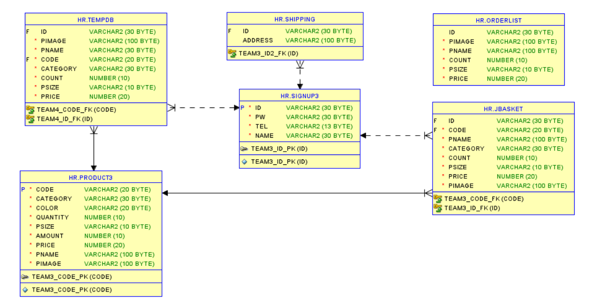
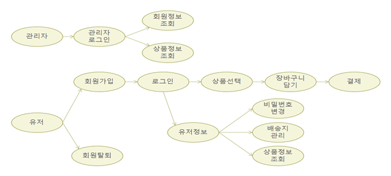
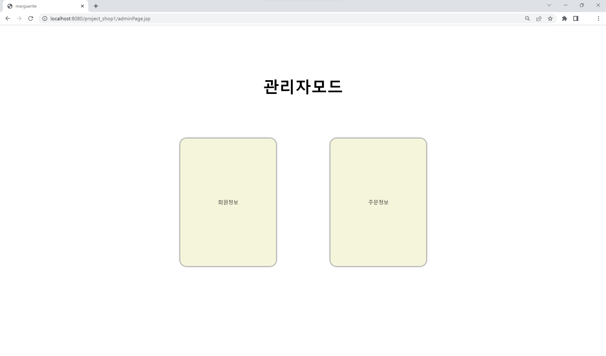
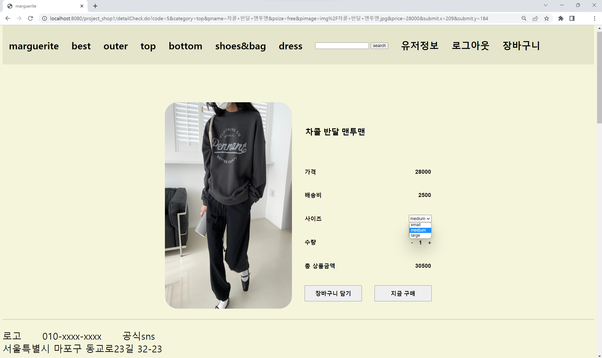
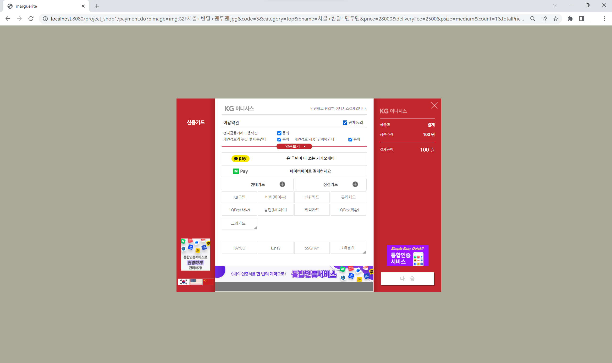
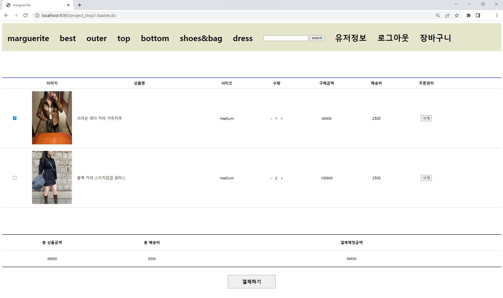
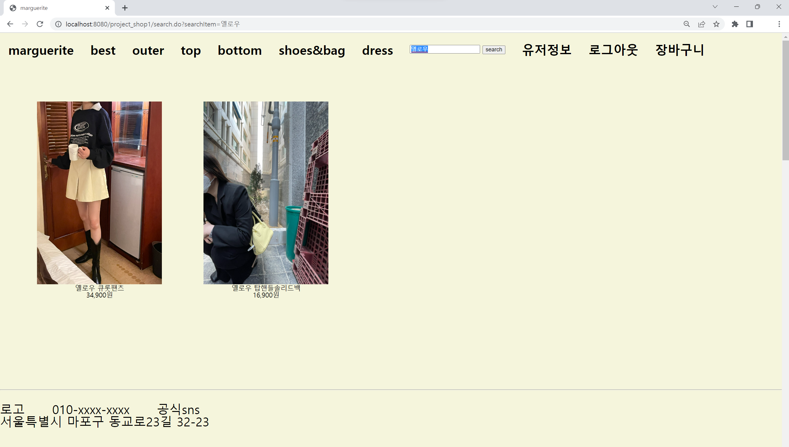
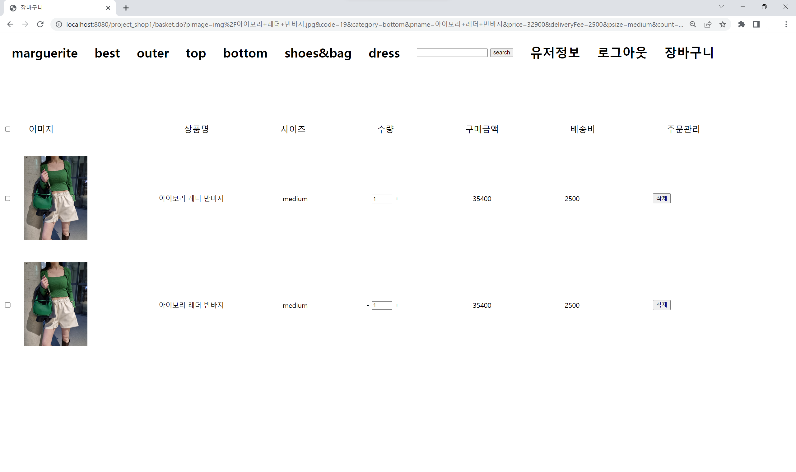

## :pushpin: marguerite
>쇼핑몰 웹 사이트 

### 1. 제작기간&참여 인원

* 2023.02.13. ~ 2023.03.04.   
* 팀프로젝트(3인)

### 2. 사용기술

* JAVA11
* ORACLE
* JSP
* css
* JAVASCRIPT
* AJAX

### 3. ERD

### 4. 핵심기능

>Admin  ( 회원 목록 조회, 주문 목록 조회 )
- 회원 목록을 조회할 수 있다.
- 주문 목록을 조회할 수 있다.
>Client ( 회원가입 / 탈퇴, 아이디 / 비밀번호 찾기, 로그인, 유저정보, 상품 검색, 장바구니, 상품 결제 및 주문 확인 )   
1. 비회원   
    - 상품 검색 및 상품 조회를 할 수 있다.
2. 회원   
    -	아이디 / 비밀번호를 분실했을 때 찾기 기능을 통해 조회하고 로그인할 수 있다.
    -	상품 검색 및 상품 조회를 할 수 있다.
    -	고민하고 있는 상품을 장바구니에 담아 저장할 수 있다.
    -	상품을 바로 결제하거나 장바구니에 담은 상품을 결제를 할 수 있다.
    -	주문한 내역을 조회할 수 있다.
    -	비밀번호를 수정하거나 회원탈퇴를 할 수 있다.

상세설명 펼치기

 

#### 4-1. 전체흐름

 
 

#### 4-2. Connection ✔️ [코드확인](https://github.com/jin4618/marguerite/blob/c13529b382a5d3a154e9e84cdc4cab8ba253eb0d/src/dbconn/DBConn.java)

-	JDBC를 활용한 OracleDB 연결

 

#### 4-3. 관리자 페이지

 

- 회원정보 조회
- 주문정보회조회

 

#### 4-4. 카테고리

 

- Best : 매출 수량을 기반으로 10개의 상품을 뽑아 출력
    - 수량이 같을 경우에는 가격 순으로 뽑는다. ✔️ [코드확인](https://github.com/jin4618/marguerite/blob/c47be8396b7bed487ad6661188ac0e79c9ef7c0a/src/dao/DAO.java#L257)
- Outer, Top, Bottom, Shoes&Bag, Dress 구성으로 원하는 카테고리를 골라 쇼핑할 수 있다.
    
 

#### 4-5. 회원가입

-	아이디, 이름, 비밀번호, 비밀번호 확인, 전화번호를 입력 ✔️ [비밀번호 확인 코드](https://github.com/jin4618/marguerite/blob/c13529b382a5d3a154e9e84cdc4cab8ba253eb0d/WebApp/join.jsp#L8-L16)
    - Controller를 거쳐 DB에서 ‘signup3’ 테이블에 회원정보를 INSERT
    
    
 

#### 4-6. 로그인

-	아이디와 비밀번호 입력
    - Controller를 거쳐 DB에 ‘signup3’ 테이블에서 회원정보와 비교하여 일치할 경우 로그인
    
    
 

#### 4-7. 아이디 / 비밀번호 찾기

-	아이디는 이름과 전화번호를 입력 받아, 비밀번호는 아이디와 전화번호를 입력 받아 찾기를 진행
    - DB에 ‘signup3’ 테이블에서 회원정보와 비교하여 일치하는 결과를 팝업창으로 출력 ✔️ [코드확인](https://github.com/jin4618/marguerite/blob/c13529b382a5d3a154e9e84cdc4cab8ba253eb0d/src/com/shop/command/impl/CommandUserFindId.java#L33-L49)
   
    
 

#### 4-8. 유저정보

1. 비밀번호 변경

    - 아이디、 현재 비밀번호、 바꿀 비밀번호를 입력하여 비밀번호를 변경할 수 있다.
        - 아이디와 현재 비밀번호를 조건으로 걸어 UPDATE

2. 배송지 관리

    -	가입 직후에는 ‘등록 전’으로 배송지가 ‘shipping’ 테이블에 등록되고, 배송지는 유저 정보에서 따로 등록하고 싶을 때 배송지 관리에서 수정할 수 있다.

3. 주문내역 확인

    - 상품을 주문했던 내역을 DB에 'orderList' 테이블에서 가져와 출력

 

#### 4-9. 상품 상세 정보

 

- 원하는 상품을 눌러 가격, 배송비를 확인하고 사이즈와 수량을 선택하여 총 상품 금액을 확인할 수 있다.
- 장바구니에 담거나 바로 구매가 가능하다.

    #### 상품 결제
    
    
     
    
    - KG 이니시스 결제 API를 이용하여 원하는 결제 방법을 선택하고 결제한다. ✔️ [코드확인](https://github.com/jin4618/marguerite/blob/c47be8396b7bed487ad6661188ac0e79c9ef7c0a/WebApp/payment.jsp)

 

#### 4-10. 장바구니

 

- 장바구니에 담았던 상품 목록들이 이미지, 상품명, 사이즈, 수량, 구매 금액, 배송비 정보와 함께 출력되며 삭제도 가능하다.
- 체크 박스로 결제할 상품들을 선택하여 총 상품금액, 총 배송비, 결제 예정 금액을 확인할 수 있다.

 

#### 4-11. 상품 검색 ✔️ [코드확인](https://github.com/jin4618/marguerite/blob/c47be8396b7bed487ad6661188ac0e79c9ef7c0a/src/dao/DAO.java#L206)

 

- 원하는 상품 이름 또는 색깔을 검색하여 조회할 수 있다.

 

#### 4-12. 회원탈퇴

- 아이디와 비밀번호를 입력
    - Controller를 거쳐 DB에 ‘signup3’ 테이블에서 회원정보와 비교하여 일치할 경우 DELETE

 

### 5. 핵심 트러블 슈팅

#### 5-1. 장바구니 상품 중복 문제

문제 확인

장바구니에서 같은 상품을 담을 때 사이즈가 같아도 따로따로 들어가는 문제를 Merge 문을 활용하여 상품 이름과 상품 사이즈를 조건을 걸어 일치하면 추가한 수량만큼 수량과 가격을 UPDATE 없으면 INSERT

✔️ 기존 코드

    
    String sql = "INSERT INTO JBASKET VALUES (?, ?, ?, ?, ?, ?, ?, ?)";

✔️ 개선된 코드

https://github.com/jin4618/marguerite/blob/c47be8396b7bed487ad6661188ac0e79c9ef7c0a/src/dao/DAO.java#L468-L472

 

#### 5-2. 상품 상세정보 / 장바구니 페이지에서 한 form에서 2개의 버튼 경로 다르게하는 문제
상세정보 페이지에서는 장바구니 담기 / 바로구매 버튼, 장바구니 페이지에서는 삭제 / 결제 버튼   
두 페이지 모두 form은 결제 폼으로 감싸져 경로 또한 어떤 버튼을 누르든 결제 Controller 로 갔다.   
그래서 이러한 문제를 JavaScript의 onclick 이벤트를 활용하여 해결

✔️ 개선된 코드

- 이벤트구현
https://github.com/jin4618/marguerite/blob/c47be8396b7bed487ad6661188ac0e79c9ef7c0a/WebApp/detailCheck.jsp#L322-L323
- 함수구현
https://github.com/jin4618/marguerite/blob/c47be8396b7bed487ad6661188ac0e79c9ef7c0a/WebApp/detailCheck.jsp#L188-L204

 

#### 5-3. 장바구니 수량 문제
수량을 올리거나 내릴 때 어떤 상품을 누르든 맨 위 상품만 수량이 변경되는 문제로   
DB에 'JBasket' 테이블에서 수량과 가격을 UPDATE 할 수 있는 CountUp, CountDown 메소드를 만들고 View에서는 onclick 이벤트로 상품 이름과 사이즈 데이터를 함께 경로를 지정하여 누를 때마다 UPDATE 되도록 해결

✔️ 기존 코드

    
    
    
    
    

        -
            <input class="count" id="count" type="text"  size="2" name="count" value="${plist.count}" max="10" />
		+
	

✔️ 개선된 코드

https://github.com/jin4618/marguerite/blob/5ee4eb9bca147402a821473d650e54f5b3cdd55d/src/dao/DAO.java#L537-L582
https://github.com/jin4618/marguerite/blob/5ee4eb9bca147402a821473d650e54f5b3cdd55d/WebApp/Basket.jsp#L300-L304

 

#### 5-4. shoes&bag 사이즈 문제
상품 상세 정보를 한 페이지로 이용하다보니 신발과 가방에도 사이즈가 Large, Medium, Small 사이즈로 출력되는 문제

✔️ 개선된 코드

    
- JSTL을 활용하여 카테고리가 'shoes&bag'일 때는 사이즈가 free로 출력되도록 해결
https://github.com/jin4618/marguerite/blob/3a310673a0e6425795d04241faf891a11a91bb72/WebApp/detailCheck.jsp#L295-L308

 

### 6. 느낀점
Mubi 프로젝트를 하며 부족함을 많이 느껴 스터디로 토이 프로젝트를 진행하였습니다. 그 결과가 이 marguerite 프로젝트로 그 전에 해보지 않았던 비밀번호 확인, 아이디 / 비밀번호 찾기 팝업창 구현, Merge문 활용, 장바구니 담기 등등 많은 도전과 성공이 있었습니다. 또한, 팀원들과의 시너지도 좋았기에 더 재미있게 진행할 수 있었습니다. 다만, 시간이 부족하여 아직 미흡한 부분이 많습니다. 앞으로도 짬짬히 계속 수정하고 구현하고 싶은 기능을 추가하여 발전해 나갈 것입니다.

